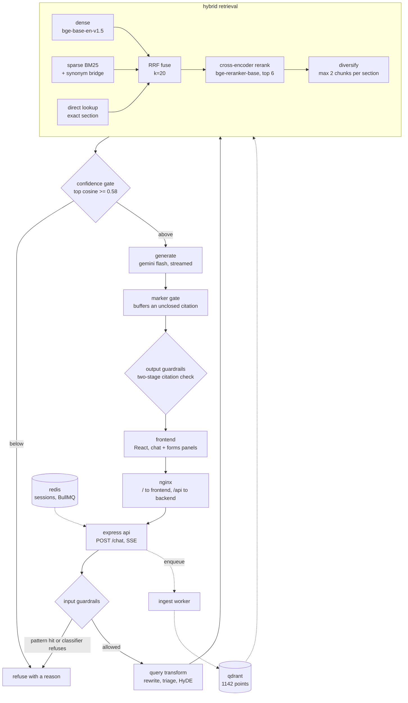

# Architecture

Two panels over one Node backend. The chatbot answers from the Bharatiya Nagarik
Suraksha Sanhita, 2023 and cites Act + Section for every claim; the forms library
serves 58 PDFs cut out of the same source file.

## The shape of it



## Request lifecycle

### A statute question

1. `POST /api/v1/chat`. `x-session-id` identifies the caller; a request id is
   minted and rides every log line from here on.
2. **Input guardrails.** 15 regex rules run first — they cost nothing and catch
   the obvious injections. Anything that survives goes to a small-model
   classifier that decides `concept | document | out_of_scope`. A pattern hit
   never fails open, even if the classifier disagrees.
3. **Query transform.** With history, the question is rewritten to stand alone.
   The same call triages intent and writes a HyDE passage — two to four sentences
   in the voice of a bare act. If the question names a section (`s.103`,
   `BNS 351`), that is recorded as a lookup intent and HyDE is skipped.
4. **Retrieval.** Three legs:
   - *dense*: the HyDE passage (or the raw question) embedded with
     bge-base-en-v1.5, query-side instruction prefix applied.
   - *sparse*: BM25 over Qdrant sparse vectors. The query passes through the
     synonym bridge first, so "anticipatory bail" also searches for
     "apprehending arrest", which is what the act actually says.
   - *direct lookup*: if a section number was detected, that section is pulled by
     payload filter and pinned on top. The act is taken from the question and
     defaults to BNSS, because the First Schedule holds BNS sections and
     "section 63" means two different provisions.

   Dense and sparse are fused with RRF at k=20. A cross-encoder reranks the top
   6 in full, then a diversity pass caps any one section at 2 chunks so three
   fragments of s.187 cannot crowd out everything else.
5. **Confidence gate.** The best *cosine* — not the RRF score, which is a rank
   and not a similarity — must clear 0.58. Below that the bot says it does not
   know. Measured on this corpus: in-scope questions land 0.62–0.80, out-of-scope
   0.37–0.53.
6. **Generation.** Retrieved passages are numbered into the prompt and streamed
   through Gemini Flash.
7. **Output guardrails.** Tokens pass through a marker gate that holds back
   everything from an unmatched `[` until the `]` arrives, so an invented
   citation never reaches the screen even mid-stream. A second pass over the
   finished answer validates in two stages: a permissive pattern catches anything
   bracket-shaped, then a strict pattern parses it. Anything that does not parse,
   or names a section that was not retrieved, is stripped. A subsection no
   retrieved chunk can evidence is dropped from the marker rather than bound to
   the wrong passage.

### An upload

1. `POST /api/v1/documents/upload`. Multer writes to disk, the first five bytes
   are checked for `%PDF-` — the client's content-type is not trusted — and the
   job is queued on BullMQ.
2. The worker parses, chunks, embeds and upserts into a **separate collection**
   with `session_id` in every payload. `GET /documents/{id}/status` reports
   parse → chunk → embed → ready.
3. Deleting a document purges its vectors, not just the row.

### A document question

Same path, except retrieval runs a second leg against the document collection
filtered by `session_id` and the requested `document_ids`, and the two result
lists are fused together. A document chunk cites as `[doc: name.pdf p.2]`, so
user evidence is never confused with statutory authority.

Uploaded text is untrusted. Before it reaches the prompt, any sentence that reads
as an instruction is **removed from the context** — the model is never asked
nicely to ignore an injection, it simply never sees it.

## Chunking schema

The section is the atomic unit. A section shorter than 1800 characters is never
split; a longer one splits at subsection, then lettered clause, then sentence —
never mid-sentence. Provisos, Explanations, Exceptions and Illustrations always
stay attached to the clause above them.

```json
{
  "act": "Bharatiya Nagarik Suraksha Sanhita, 2023",
  "act_short": "BNSS",
  "chapter": "VI",
  "chapter_title": "Processes To Compel Appearance",
  "section_number": "63",
  "section_title": "Form of summons",
  "subsection": "(1)",
  "clause": null,
  "text": "...",
  "embed_text": "chapter title + heading + text",
  "has_illustration": false,
  "has_proviso": true,
  "has_exception": false,
  "has_explanation": true,
  "references": ["2", "35"],
  "page_start": 20,
  "page_end": 20,
  "chunk_id": "bnss-s63-001",
  "source_uri": "...",
  "ingested_at": "..."
}
```

`embed_text` carries the chapter title and the section heading above the text.
The chapter title is what connects "processes to compel appearance" to a question
about summonses when the section itself never uses those words.

Three kinds of chunk share the schema and one collection:

| kind | `act_short` | `chapter` | count | why it exists |
|---|---|---|---|---|
| statute section | BNSS | roman numeral | 643 | the bare act |
| First Schedule entry | **BNS** | `First Schedule` | 441 | whether an offence is cognizable, bailable, and who tries it |
| Second Schedule form | BNSS | `Second Schedule` | 58 | "which form summons an accused" is a form question, not a section question |

The schedule rows are BNS sections printed in the BNSS gazette, so they carry
`act_short: "BNS"` and cite as `[BNS s.351]`. Keeping the acts apart is what
stops "section 63" resolving to a rape provision instead of the summons form.

## Parsing the source

The gazette PDF is badly typeset for machines: section titles sit in a marginal
column, chapter headings are small caps, and the First Schedule is a six-column
table whose rows the typesetter sometimes emits as a single run spanning two
columns.

- Runs are classified by coordinates, not font size alone — a marginal note is
  both *small* and *outdented*, because chapter headings are small too.
- Section starts are gated on sequence: only the number that comes next is
  accepted, which kills every mid-sentence "section 187" false positive.
- Schedule rows are assigned to columns by x position, and a run that crosses a
  column edge by more than a word is cut and redistributed.
- OCR (Tesseract) is a documented fallback for any page whose text layer is
  missing, and it logs which pages needed it.

## Deployment

`docker compose up` brings up qdrant, redis, two TEI servers (embeddings and
reranker), the api, the ingest worker and the frontend on one network with
health checks and named volumes. Every published port binds to `127.0.0.1`;
only nginx faces outward.

On the deployed box TLS terminates at a Google load balancer, so nginx speaks
plain HTTP and the app trusts `X-Forwarded-Proto` rather than `$scheme`.
`docker-compose.gpu.yml` moves both TEI servers onto an NVIDIA card, which is
worth about 60x on reranking (1500 ms to 4–6 ms) and 30x on ingestion.
